# ORION 1.0 — 24H National Hackathon Platform
### Microsoft Club SIST • Sathyabama Institute of Science and Technology, Chennai

[](https://nextjs.org/)
[](https://react.dev/)
[](https://www.typescriptlang.org/)
[](https://tailwindcss.com/)
[](https://supabase.com/)
[](https://razorpay.com/)
[](https://threejs.org/)
[](LICENSE)

---

## 1. Executive Overview

**ORION 1.0** is a full-stack, aerospace-themed mission portal and registration platform for the nationwide 24-hour hackathon organized by **Microsoft Club SIST** at the **Sathyabama Institute of Science and Technology (SIST)** in Chennai, India.

The platform includes a **6-step registration flow**, **server-side Razorpay payment verification**, a **Supabase PostgreSQL database**, a **live registration telemetry count**, and an **organizer Admin Command Center** with real-time sync and CSV export.

* **Prize Pool**: **₹1,00,000** total cash rewards, merit bounties, and incubation grants.
* **Squad Structure**: Fixed **5 Participants** per squad (1 Team Leader + 4 Team Members).
* **Round 1 Entry Fee**: **₹100 FLAT PER TEAM** (single payment transaction for full team).
* **Offline Finale**: Top 70 Finalist squads invited to the 24-hour offline hackathon at SIST Chennai.
* **Venue**: School of Computing Complex, Sathyabama Institute of Science and Technology (OMR, Chennai).

---

## 2. Full-Stack Architecture

```mermaid
flowchart TD

subgraph group_public["Public registration"]
  node_landing["Landing page<br/>Next.js page<br/>[page.tsx]"]
  node_event_data["Event content<br/>static data<br/>[orionData.ts]"]
  node_register_modal["Registration modal<br/>React client UI<br/>[RegisterModal.tsx]"]
  node_receipt_modal["Payment receipt<br/>React client UI"]
end

subgraph group_server["Server API"]
  node_registration_api["Registration API<br/>POST route handler<br/>[route.ts]"]
  node_registration_count["Public count/status API<br/>route handler<br/>[route.ts]"]
  node_create_order["Create payment order<br/>POST route handler<br/>[route.ts]"]
  node_verify_payment["Verify payment<br/>POST route handler<br/>[route.ts]"]
end

subgraph group_access["Participant and organizer access"]
  node_portal_page["Team portal<br/>Next.js page<br/>[page.tsx]"]
  node_team_auth["Team authentication<br/>route handler<br/>[route.ts]"]
  node_portal_api["Portal data API<br/>route handler<br/>[route.ts]"]
  node_submission_api["Team submission API<br/>route handler<br/>[route.ts]"]
  node_admin_page["Organizer command center<br/>Next.js page<br/>[page.tsx]"]
  node_admin_config["Admin access validation<br/>route handler<br/>[route.ts]"]
  node_admin_registrations["Admin registrations API<br/>route handler<br/>[route.ts]"]
end

subgraph group_integrations["Persistence and operations"]
  node_supabase_client["Supabase server client<br/>data access layer<br/>[supabase.ts]"]
  node_database[("Teams and members<br/>PostgreSQL schema<br/>[schema.sql]")]
  node_razorpay{{"Razorpay<br/>payment gateway"}}
  node_reminder_cron["Payment reminder cron<br/>scheduled route handler<br/>[route.ts]"]
  node_email["Email delivery<br/>server service<br/>[email.ts]"]
  node_rate_limit["Rate limiting<br/>server guard<br/>[rateLimit.ts]"]
end

node_landing -->|"renders content"| node_event_data
node_landing -->|"opens"| node_register_modal
node_landing -->|"reads telemetry"| node_registration_count
node_register_modal -->|"submits team"| node_registration_api
node_register_modal -->|"starts checkout"| node_create_order
node_create_order -->|"creates order"| node_razorpay
node_razorpay -->|"returns payment/signature"| node_verify_payment
node_verify_payment -->|"confirmation result"| node_receipt_modal
node_registration_api -->|"persists"| node_supabase_client
node_create_order -->|"checks team"| node_supabase_client
node_verify_payment -->|"confirms status"| node_supabase_client
node_supabase_client -->|"reads and writes"| node_database
node_portal_page -->|"authenticates"| node_team_auth
node_portal_page -->|"loads state"| node_portal_api
node_portal_page -->|"submits"| node_submission_api
node_team_auth -->|"looks up team"| node_supabase_client
node_portal_api -->|"reads portal data"| node_supabase_client
node_submission_api -->|"stores submission"| node_supabase_client
node_admin_page -->|"validates access"| node_admin_config
node_admin_page -->|"loads operations data"| node_admin_registrations
node_admin_registrations -->|"retrieves records"| node_supabase_client
node_reminder_cron -->|"finds unpaid teams"| node_supabase_client
node_reminder_cron -->|"sends reminders"| node_email
node_registration_api -.->|"protected by"| node_rate_limit
node_create_order -.->|"protected by"| node_rate_limit

click node_landing "https://github.com/goprocker/orion-hackathon/blob/main/src/app/page.tsx"
click node_event_data "https://github.com/goprocker/orion-hackathon/blob/main/src/data/orionData.ts"
click node_register_modal "https://github.com/goprocker/orion-hackathon/blob/main/src/components/modals/RegisterModal.tsx"
click node_receipt_modal "https://github.com/goprocker/orion-hackathon/blob/main/src/components/modals/PaymentReceiptModal.tsx"
click node_registration_api "https://github.com/goprocker/orion-hackathon/blob/main/src/app/api/registrations/route.ts"
click node_registration_count "https://github.com/goprocker/orion-hackathon/blob/main/src/app/api/registrations/count/route.ts"
click node_create_order "https://github.com/goprocker/orion-hackathon/blob/main/src/app/api/payment/create-order/route.ts"
click node_verify_payment "https://github.com/goprocker/orion-hackathon/blob/main/src/app/api/payment/verify/route.ts"
click node_portal_page "https://github.com/goprocker/orion-hackathon/blob/main/src/app/portal/page.tsx"
click node_team_auth "https://github.com/goprocker/orion-hackathon/blob/main/src/app/api/auth/team/route.ts"
click node_portal_api "https://github.com/goprocker/orion-hackathon/blob/main/src/app/api/team/portal/route.ts"
click node_submission_api "https://github.com/goprocker/orion-hackathon/blob/main/src/app/api/team/submission/route.ts"
click node_admin_page "https://github.com/goprocker/orion-hackathon/blob/main/src/app/admin/page.tsx"
click node_admin_config "https://github.com/goprocker/orion-hackathon/blob/main/src/app/api/admin/config/route.ts"
click node_admin_registrations "https://github.com/goprocker/orion-hackathon/blob/main/src/app/api/admin/registrations/route.ts"
click node_supabase_client "https://github.com/goprocker/orion-hackathon/blob/main/src/lib/supabase.ts"
click node_database "https://github.com/goprocker/orion-hackathon/blob/main/src/db/schema.sql"
click node_reminder_cron "https://github.com/goprocker/orion-hackathon/blob/main/src/app/api/cron/payment-reminders/route.ts"
click node_email "https://github.com/goprocker/orion-hackathon/blob/main/src/lib/email.ts"
click node_rate_limit "https://github.com/goprocker/orion-hackathon/blob/main/src/lib/rateLimit.ts"

classDef toneNeutral fill:#f8fafc,stroke:#334155,stroke-width:1.5px,color:#0f172a
classDef toneBlue fill:#dbeafe,stroke:#2563eb,stroke-width:1.5px,color:#172554
classDef toneAmber fill:#fef3c7,stroke:#d97706,stroke-width:1.5px,color:#78350f
classDef toneMint fill:#dcfce7,stroke:#16a34a,stroke-width:1.5px,color:#14532d
classDef toneRose fill:#ffe4e6,stroke:#e11d48,stroke-width:1.5px,color:#881337
classDef toneIndigo fill:#e0e7ff,stroke:#4f46e5,stroke-width:1.5px,color:#312e81
classDef toneTeal fill:#ccfbf1,stroke:#0f766e,stroke-width:1.5px,color:#134e4a
class node_landing,node_event_data,node_register_modal,node_receipt_modal toneBlue
class node_registration_api,node_registration_count,node_create_order,node_verify_payment toneAmber
class node_portal_page,node_team_auth,node_portal_api,node_submission_api,node_admin_page,node_admin_config,node_admin_registrations toneMint
class node_supabase_client,node_database,node_razorpay,node_reminder_cron,node_email,node_rate_limit toneRose
```



---

## 3. Multi-Step Registration Wizard

The registration system ([RegisterModal.tsx](file:///c:/orion-1.0/src/components/modals/RegisterModal.tsx)) features a 6-step flow:

1. **Step 1 — Team Information**:
   - Team Name (`e.g. Aether Dynamics`)
   - Team Leader Name (`e.g. Kavya Ramesh`)
   - Leader WhatsApp Phone Number (`+91` 10-digit Indian phone validation)
   - Leader Email Address (Email regex validation)
   - Institution / College Name
   - Problem Statement dropdown (`ORION-PS-01` to `ORION-PS-04`)
2. **Step 2 — Team Members (4 Crew Members)**:
   - Collects Name and Phone Number for each of the 4 members.
   - Leader is not repeated. Exactly 5 participants total.
3. **Step 3 — Declaration & Consent**:
   - 5 mandatory checkboxes confirming accuracy, membership, rules agreement, fee structure, and qualifier terms.
4. **Step 4 — Review Before Payment**:
   - Comprehensive review dossier with quick `[ EDIT DETAILS ]` and `[ PROCEED TO CHECKOUT — ₹100 ]`.
5. **Step 5 — Payment Gateway**:
   - Razorpay payment modal with server-side order creation.
   - Includes Sandbox Simulation mode when testing locally before entering live API keys.
6. **Step 6 — Registration Confirmed**:
   - Unique `ORN-R1-XXXX` registration ID, confirmed team parameters, `[ JOIN WHATSAPP GROUP ]`, `[ VIEW RULES ]`, and `[ DOWNLOAD RECEIPT ]` (downloadable formatted receipt).

---

## 4. Database Schema (Supabase PostgreSQL)

The database schema ([schema.sql](file:///c:/orion-1.0/src/db/schema.sql)) uses two relational tables:

### `public.teams` Table
| Column | Type | Constraints | Description |
| :--- | :--- | :--- | :--- |
| `id` | `uuid` | `PRIMARY KEY, DEFAULT gen_random_uuid()` | Unique team row ID |
| `registration_id` | `text` | `UNIQUE, NOT NULL` | Standardized ID (`ORN-R1-XXXX`) |
| `team_name` | `text` | `NOT NULL` | Squad / Team Name |
| `leader_name` | `text` | `NOT NULL` | Squad Leader Name |
| `leader_phone` | `text` | `NOT NULL` | 10-digit Leader Phone |
| `leader_email` | `text` | `NOT NULL` | Leader Email Address |
| `institution` | `text` | `NOT NULL` | College / University |
| `problem_statement`| `text` | `NOT NULL` | Selected Track (`ORION-PS-01` to `04`) |
| `payment_status` | `text` | `NOT NULL, DEFAULT 'PENDING'` | `PENDING`, `SUCCESS`, `FAILED` |
| `payment_id` | `text` | | Razorpay payment ID |
| `order_id` | `text` | | Razorpay order ID |
| `amount` | `integer` | `NOT NULL, DEFAULT 100` | ₹100 Flat |
| `registration_status`| `text` | `NOT NULL, DEFAULT 'PENDING'`| `REGISTERED`, `PENDING` |
| `created_at` | `timestamptz`| `DEFAULT now()` | Timestamp |

### `public.team_members` Table
| Column | Type | Constraints | Description |
| :--- | :--- | :--- | :--- |
| `id` | `uuid` | `PRIMARY KEY, DEFAULT gen_random_uuid()` | Unique member row ID |
| `team_id` | `uuid` | `REFERENCES public.teams(id) ON DELETE CASCADE`| Foreign key |
| `member_number`| `integer` | `CHECK (member_number BETWEEN 1 AND 4)` | Member 1 to 4 |
| `member_name` | `text` | `NOT NULL` | Member Name |
| `member_phone` | `text` | `NOT NULL` | Member Phone |

---

## 4b. Round 1 Presentation Submission & Re-upload Approval

The Round 1 deck follows a **submit once, replace only with approval** rule.

```
Payment VERIFIED by organiser
          │
          ▼
  First PPT upload  ──────────►  status: ACCEPTED   (auto-accepted, no sign-off)
          │
          │  team wants to change it
          ▼
  POST /api/team/resubmission  ──►  request status: PENDING
          │
          ▼
  Organiser reviews in /admin  ──►  APPROVED  ──►  team uploads once
          │                              │              │
          │                              │              ▼
          └──► REJECTED                  │        new deck ACCEPTED
               existing deck stands      │        old deck SUPERSEDED
                                         │        request  USED
                                         ▼
                              a further change needs a NEW request
```

* **First upload is free** once payment is `VERIFIED` — it is auto-accepted and is
  the version the jury evaluates.
* **Each approval is worth exactly one re-upload.** Spending it flips the request
  to `USED`; another change needs a fresh request.
* **One request in flight per team**, enforced by a partial unique index so a
  double-submit cannot open two.
* Approve/reject decisions email the team leader, with the organiser's note.
* `allowRound1Resubmission: false` in Settings remains a global kill switch that
  blocks all replacements regardless of approvals.

### Applying the database migrations

Run these once each in the Supabase SQL Editor against an existing project, in
order (each is idempotent):

```
src/db/migrations/001_resubmission_requests.sql      re-upload workflow table + columns
src/db/migrations/002_lock_down_rls.sql              drop the public read/write RLS policies
src/db/migrations/003_private_submissions_bucket.sql make the submissions bucket private
```

Order matters for the two security migrations: deploy the application code
first, then apply them. 002 needs `SUPABASE_SERVICE_ROLE_KEY` set or every query
starts failing; 003 makes existing public deck URLs stop resolving, and only the
deployed code knows how to mint signed ones.

Fresh installs get everything from `src/db/schema.sql` and can skip 001.

> The migration also adds `submissions.project_url / repo_url / demo_url` and
> `teams.evaluation_scores` — columns the application already wrote but that were
> missing from `schema.sql`.

---

## 4c. Transactional Email Deliverability

All mail goes through one hardened dispatcher in `src/lib/email.ts`:

| Measure | Why |
| :--- | :--- |
| Plain-text alternative on every message | HTML-only mail is the largest controllable spam-score penalty |
| Single pooled, rate-limited transporter | A TCP+TLS+AUTH handshake per message gets the sender throttled |
| Envelope sender pinned to `SMTP_USER` | Keeps SPF/DKIM aligned under DMARC; a mismatched `EMAIL_FROM` is warned about and overridden |
| `List-Unsubscribe` + one-click POST | Required by Google and Yahoo bulk sender rules since Feb 2024 |
| Hidden preheader per template | Stops clients scraping boilerplate as the preview line |
| Distinct `Message-ID` / `X-Entity-Ref-ID` | Stops Gmail threading separate notices together |
| Certificate validation enforced | `rejectUnauthorized: false` never helped delivery and accepted MITM |
| Subject lines de-spammed | Dropped `[ORION 1.0]` prefixes and "Action Required" |

Verify SMTP credentials from the admin API without sending anything:

```bash
curl -X POST https://your-host/api/admin/registrations \
  -H "x-admin-key: $ADMIN_SECRET_KEY" \
  -H 'Content-Type: application/json' \
  -d '{"action":"CHECK_MAILER"}'
```

> Automatic dispatch on signup stays **off** by design. Organisers send the
> registration email explicitly with the `SEND_REGISTRATION_EMAIL` admin action.

---

## 5. Organizer Admin Command Center (`/admin`)

Access the organizer dashboard at `/admin`:
* **Passcode Protected**: Protected by `ADMIN_SECRET_KEY` configured in `.env.local`.
* **Telemetry Overview**: Total Squads, Payment Confirmed, Payment Pending, Payment Failed, and Revenue.
* **Track Breakdown**: Real-time distribution across all 4 problem statements.
* **Search & Filter**: Search by Registration ID (`ORN-R1-...`), team name, leader, or college; filter by track and payment status.
* **5-Member Squad Drawer**: Expand any team to view leader contacts and all 4 crew members.
* **Live Auto-Polling**: Automatically syncs incoming registrations in the background every 6 seconds.
* **Re-upload Request Queue**: A `RE-UPLOAD REQ` metric tile and per-squad roster badge surface teams waiting on a PPT replacement decision; approve or decline from the squad drawer with a note that is emailed to the team.
* **1-Click CSV Export**: Downloads complete `ORION_1.0_Registrations.csv` file.

---

## 6. Project Setup & Quickstart

### Prerequisites
* **Node.js**: v18.0 or higher
* **npm**: v9.0 or higher

### Installation
```bash
# 1. Clone repository
git clone https://github.com/praveeneyyy/orion-1.0.git
cd orion-1.0

# 2. Install dependencies
npm install

# 3. Create .env.local file
cp .env.example .env.local
```

### Environment Configuration (`.env.local`)
```env
# Supabase PostgreSQL
NEXT_PUBLIC_SUPABASE_URL=https://your-project-id.supabase.co
NEXT_PUBLIC_SUPABASE_ANON_KEY=your-anon-public-key

# Razorpay Gateway (₹100 Flat per Team)
NEXT_PUBLIC_RAZORPAY_KEY_ID=rzp_test_YourKeyId
RAZORPAY_KEY_SECRET=YourRazorpaySecret

# Admin Passcode for /admin
ADMIN_SECRET_KEY=orion_genesis_2026

# Official WhatsApp Link
NEXT_PUBLIC_WHATSAPP_GROUP_URL=https://chat.whatsapp.com/orion1point0
```

### Run Locally
```bash
# Start development server
npm run dev

# Build production bundle
npm run build

# Start production server
npm start
```

---

## 7. Problem Statement Tracks

1. **ORION-PS-01: FloatChat** — Oceanic Autonomous Telemetry & Generative AI Float Analytics
2. **ORION-PS-02: LexVault** — Zero-Knowledge Verifiable Legal Discovery & Compliance LLM Mesh
3. **ORION-PS-03: SylvaSense** — Ecological Acoustic Edge Intelligence & Bioacoustic Monitoring
4. **ORION-PS-04: Open Innovation** — High-Impact Solutions across AI, Healthcare, Fintech, and Defense

---

## 8. License

This project is open-source and licensed under the [MIT License](LICENSE).
Organized by **Microsoft Club SIST**, Sathyabama Institute of Science and Technology, Chennai.
